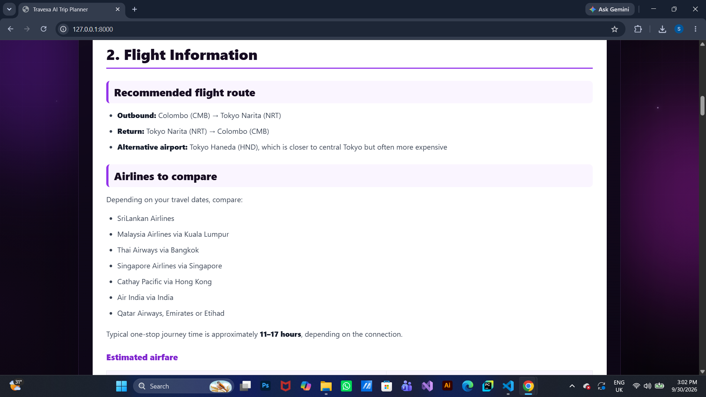
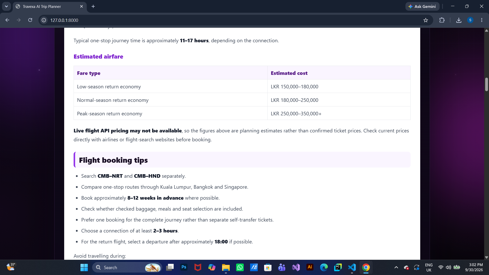
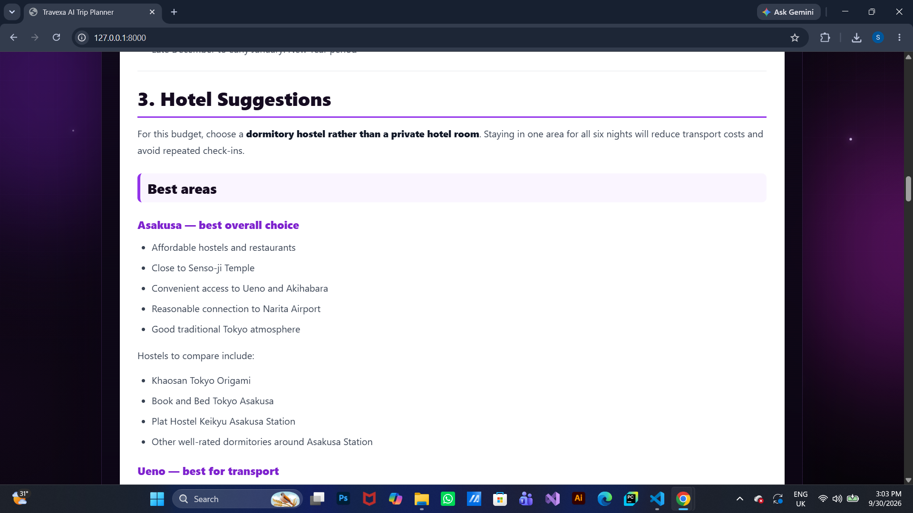
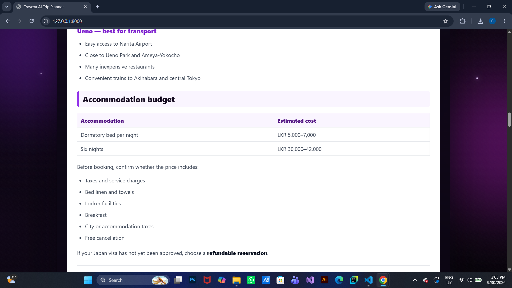
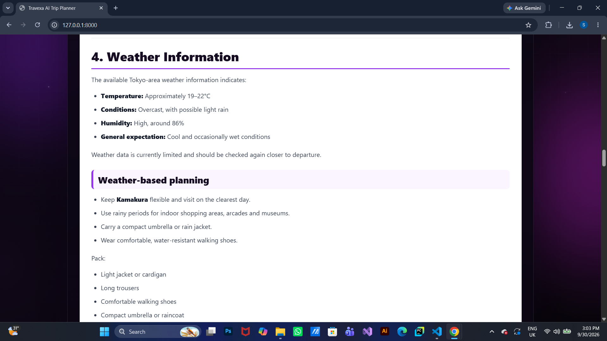
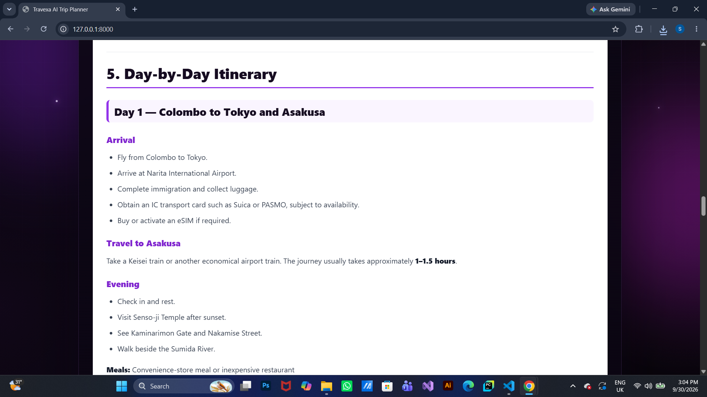
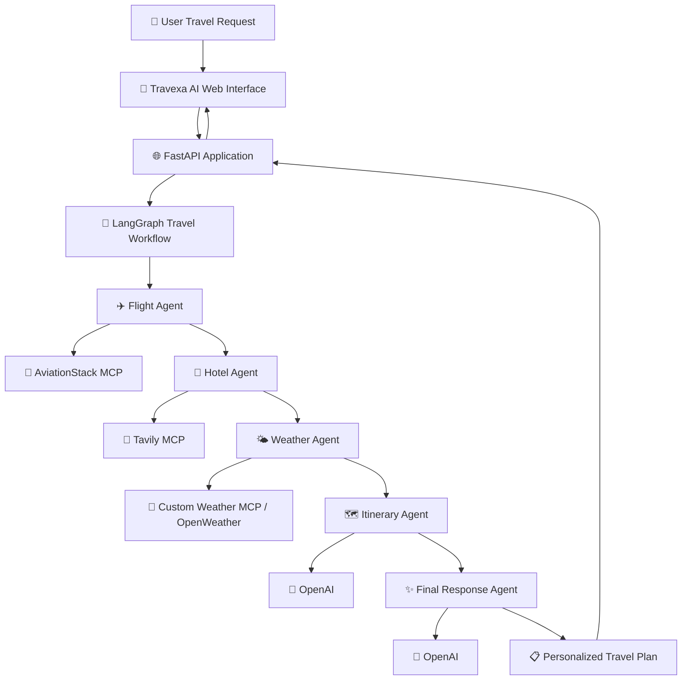

# ✈️ Travexa AI — End-to-End Multi-Agent AI Travel Planner

<p align="center">
  
  
  
  
  
  
  
  
  
  
  
  
  
  
</p>

<p align="center">
  <strong>
    An end-to-end multi-agent AI travel planning application that searches flights,
    researches hotels, checks destination weather, creates personalized itineraries, and generates structured
    travel plans through a LangGraph-powered workflow with Model Context Protocol (MCP) integrations.
  </strong>
</p>

<p align="center">
  🧳 <strong>User Travel Request</strong> →
  ✈️ <strong>Flight Agent</strong> →
  🏨 <strong>Hotel Agent</strong> →
  🌤️ <strong>Weather Agent</strong> →
  🗺️ <strong>Itinerary Agent</strong> →
  🤖 <strong>Final Response Agent</strong>
</p>

<p align="center">
  <a href="#user-interface">Screenshots</a> ·
  <a href="#installation">Installation</a>
</p>

---

## 📌 Overview

**Travexa AI** is an end-to-end multi-agent AI travel planning application built using **Python, LangGraph, LangChain, OpenAI, Model Context Protocol (MCP), Tavily, AviationStack, OpenWeather, FastAPI, HTML, CSS, and JavaScript**.

Users provide a natural-language travel request such as:

> Plan a complete 7-day England trip from Sri Lanka including flights, hotels, sightseeing, and a budget under LKR 300,000.

Travexa AI processes the request through a specialized sequential workflow:

1. **Flight Agent** retrieves relevant aviation information through the AviationStack MCP integration.
2. **Hotel Agent** searches for accommodation information through Tavily MCP.
3. **Weather Agent** retrieves current destination weather and forecast information through a custom Weather MCP server backed by OpenWeather.
4. **Itinerary Agent** combines the user's request with flight, hotel, and weather information to build a practical itinerary.
5. **Final Response Agent** creates a structured travel plan containing flights, hotels, weather, daily activities, budget guidance, and recommendations.

The application uses a **LangGraph `StateGraph`** to coordinate the travel-planning workflow.

A custom **purple neon HTML, CSS, and JavaScript interface** provides a modern AI travel-planning experience with 3D-style visual elements, animated status indicators, quick prompts, Markdown-rendered results, copy controls, and PDF export.

---

## ✨ Features

- ✈️ AI-powered travel planning.
- 🤖 Multi-agent workflow built with LangGraph.
- 🧭 Sequential specialized-agent execution.
- 🔌 Model Context Protocol (MCP) integration.
- ✈️ AviationStack MCP integration for flight information.
- 🏨 Tavily MCP integration for hotel research.
- 🌤️ Custom Weather MCP server using OpenWeather.
- 🌦️ Current weather and forecast retrieval.
- 🔎 External web information retrieval.
- 🗺️ AI-generated personalized itineraries.
- 📅 Day-by-day travel planning.
- 💰 Budget-aware itinerary generation.
- 🤖 OpenAI-powered itinerary generation.
- ✨ AI-generated final travel responses.
- 🧵 Conversation-specific thread identifiers.
- 🔄 Native async agent and MCP execution.
- 🌐 FastAPI web application.
- 📡 REST API for travel-plan generation.
- ❤️ Application health-check endpoint.
- 🎨 Custom purple neon interface.
- 🌐 3D-style animated AI travel globe.
- ✈️ Animated travel-themed elements.
- ⏳ Travel-planning activity indicators.
- ⚡ Quick travel prompts.
- 📝 Markdown-rendered AI responses.
- 📋 Copy generated travel plans.
- 📄 Export travel plans as PDF.
- 📱 Responsive interface.
- 🔐 Environment-variable configuration.
- 🧩 Modular backend, tools, frontend, and API structure.

---

<a id="user-interface"></a>

## 📸 User Interface

### Travexa AI Home

The Travexa AI home interface provides a modern purple-neon travel planning experience with an animated AI travel globe, travel-focused visual elements, quick prompts, and the main planning workspace.

<p align="center">
  
</p>

### AI Travel Request

Users can describe their complete trip requirements using natural language, including destination, duration, budget, flights, hotels, and sightseeing preferences.

<p align="center">
  
</p>

### AI Travel Plan

Travexa AI processes the request through the LangGraph workflow and presents the generated travel plan inside the result workspace.

<p align="center">
  
</p>

### Flight Information

The Flight Agent retrieves aviation information through the AviationStack MCP integration.

<p align="center">
  
</p>

<p align="center">
  
</p>

### Hotel Information

The Hotel Agent researches accommodation options through Tavily MCP.

<p align="center">
  
</p>

<p align="center">
  
</p>

### Weather Information

The Weather Agent retrieves destination weather information through the custom Weather MCP server backed by OpenWeather.

<p align="center">
  
</p>

### Day-by-Day Itinerary

The Itinerary Agent combines the user's travel request with flight, hotel, and weather information to create a practical day-by-day travel itinerary.

<p align="center">
  
</p>

### Example Itinerary PDF

A generated Travexa AI itinerary PDF is included as a project demo:

[📄 View Travexa AI Itinerary PDF](assets/pdf/travexa-ai-itinerary.pdf)

---

## 🏗️ System Architecture



The current Travexa AI workflow is sequential:

```text
START
  ↓
✈️ Flight Agent
  ↓
🏨 Hotel Agent
  ↓
🌤️ Weather Agent
  ↓
🗺️ Itinerary Agent
  ↓
🤖 Final Response Agent
  ↓
END
```

Each stage enriches the shared `TravelState` before passing it to the next stage.

---

## 🔄 How It Works

### 1️⃣ User Enters a Travel Request

The user enters a natural-language travel request through the Travexa AI web interface.

Example:

> Plan a complete 7-day England trip from Sri Lanka including flights, hotels and sightseeing under LKR 300,000.

The frontend sends the request to:

```text
POST /api/travel
```

Request structure:

```json
{
  "message": "Plan a 7-day England trip from Sri Lanka under LKR 300,000.",
  "thread_id": null
}
```

---

### 2️⃣ FastAPI Validates the Request

FastAPI receives the request through the `TravelRequest` Pydantic model:

```python
class TravelRequest(BaseModel):
    message: str
    thread_id: str | None = None
```

The message is stripped and validated before entering the travel workflow.

Empty messages return an HTTP `400` response.

Valid requests are passed to:

```python
run_travel_agent(
    user_input=user_message,
    thread_id=request_data.thread_id
)
```

---

### 3️⃣ Conversation Thread Is Prepared

If the request does not contain a `thread_id`, Travexa AI creates one:

```python
if not thread_id:
    thread_id = f"user_{uuid.uuid4().hex}"
```

The identifier is passed to LangGraph:

```python
config = {
    "configurable": {
        "thread_id": thread_id
    }
}
```

This allows graph checkpoints to remain associated with the corresponding conversation thread.

---

### 4️⃣ Flight Agent Searches for Flights

The first graph node is:

```python
flight_agent
```

It receives the original user query and calls the AviationStack MCP integration through `aviation_mcp_call(...)`.

The MCP client connects the Flight Agent to the AviationStack MCP server.

The result is stored in:

```python
flight_results
```

The updated state is then passed to the Hotel Agent.

---

### 5️⃣ Hotel Agent Researches Accommodation

The Hotel Agent creates a hotel-search query:

```python
query = f"Best Hotels for {state['user_query']}"
```

It calls Tavily through the MCP client using `tavily_mcp_search(...)`.

The returned accommodation information is stored in:

```python
hotel_results
```

The state then continues to the Weather Agent.

---

### 6️⃣ Weather Agent Retrieves Destination Weather

The Weather Agent extracts the destination from the user's travel request and uses the custom Weather MCP server.

It calls:

```python
weather_mcp_search(city)
forecast_mcp_search(city)
```

The custom MCP server retrieves current weather and forecast information from OpenWeather.

The result is stored in:

```python
weather_results
```

The state then continues to the Itinerary Agent.

---

### 7️⃣ Itinerary Agent Creates the Travel Plan

The Itinerary Agent receives:

- Original travel request.
- Flight results.
- Hotel results.
- Weather results.

The agent constructs a prompt containing the accumulated travel information.

The model is instructed to behave as an expert travel planner:

```python
response = llm.invoke([
    SystemMessage(
        content="You are an expert travel planner."
    ),
    HumanMessage(content=prompt)
])
```

The generated itinerary is stored in:

```python
itinerary
```

---

### 8️⃣ Final Response Agent Creates the Final Answer

The Final Response Agent receives:

```text
User Request
+
Flight Results
+
Hotel Results
+
Weather Results
+
Generated Itinerary
```

It produces a structured response containing:

```text
1. Trip Summary
2. Flight Information
3. Hotel Suggestions
4. Weather Information
5. Day-by-Day Itinerary
6. Estimated Budget
7. Final Recommendations
```

The final prompt also tells the model to mention when live flight information does not contain ticket pricing.

---

### 9️⃣ FastAPI Returns the Result

The API returns structured JSON:

```json
{
  "success": true,
  "thread_id": "user_example",
  "answer": "Generated final travel plan...",
  "flight_results": "Flight information...",
  "hotel_results": "Hotel information...",
  "weather_results": "Weather information...",
  "itinerary": "Generated itinerary...",
  "llm_calls": 5
}
```

The browser renders the final `answer` inside the Travexa AI result workspace.

---

## 🧠 Agents and Responsibilities

| Component | Type | Responsibility |
| --- | --- | --- |
| ✈️ Flight Agent | Travel-data node | Retrieve aviation information through AviationStack MCP |
| 🏨 Hotel Agent | Research node | Search for accommodation information through Tavily MCP |
| 🌤️ Weather Agent | Weather-data node | Retrieve current weather and forecast through the custom Weather MCP server |
| 🗺️ Itinerary Agent | LLM node | Build a practical, budget-aware itinerary |
| 🤖 Final Response Agent | LLM node | Produce the final structured travel plan |
| 🔌 `aviation_mcp_call` | MCP tool wrapper | Call AviationStack MCP tools |
| 🔎 `tavily_mcp_search` | MCP tool wrapper | Retrieve hotel and travel information |
| 🌦️ `weather_mcp_search` | MCP tool wrapper | Retrieve current weather |
| 🌦️ `forecast_mcp_search` | MCP tool wrapper | Retrieve destination forecast |

The current implementation uses five specialized sequential graph nodes.

---

## 🧠 Shared Travel State

Travexa AI uses a typed state shared across the LangGraph workflow:

```python
class TravelState(TypedDict):
    messages: Annotated[list[AnyMessage], operator.add]
    user_query: str
    flight_results: str
    hotel_results: str
    weather_results: str
    itinerary: str
    llm_calls: int
```

| State Field | Purpose |
| --- | --- |
| `messages` | Maintain messages produced during graph execution |
| `user_query` | Store the original travel request |
| `flight_results` | Store flight-search information |
| `hotel_results` | Store hotel-search information |
| `weather_results` | Store destination weather and forecast information |
| `itinerary` | Store the generated travel itinerary |
| `llm_calls` | Maintain the workflow's current processing counter |

Each graph node returns updated values that become part of the shared state.

---

## 🦜 LangGraph Workflow Composition

The travel workflow is constructed using `StateGraph`:

```python
graph = StateGraph(TravelState)

graph.add_node("flight_agent", flight_agent)
graph.add_node("hotel_agent", hotel_agent)
graph.add_node("weather_agent", weather_agent)
graph.add_node("itinerary_agent", itinerary_agent)
graph.add_node("final_agent", final_agent)

graph.add_edge(START, "flight_agent")
graph.add_edge("flight_agent", "hotel_agent")
graph.add_edge("hotel_agent", "weather_agent")
graph.add_edge("weather_agent", "itinerary_agent")
graph.add_edge("itinerary_agent", "final_agent")
graph.add_edge("final_agent", END)
```

The graph is compiled for asynchronous execution:

```python
travel_graph = graph.compile()
```

This keeps each stage of travel planning separated while allowing information to flow through one shared state.

---

## 🌐 Travel Tools

### 🔌 Model Context Protocol (MCP)

Travexa AI uses `MultiServerMCPClient` to connect specialized agents to external MCP servers.

The MCP layer currently includes:

- **Tavily MCP** for hotel and travel research.
- **AviationStack MCP** for aviation information.
- **Custom Weather MCP** for current weather and forecast information using OpenWeather.

### ✈️ AviationStack MCP

The Flight Agent uses:

```python
aviation_mcp_call(tool_name, tool_args)
```

The available AviationStack MCP tools depend on the connected AviationStack account and subscription. Some provider functions may return subscription restrictions even when the MCP server connection itself is working.

Flight API results may not always contain live ticket prices.

---

### 🔎 Tavily MCP Hotel Research

Hotel and travel information is retrieved through:

```python
tavily_mcp_search(query)
```

The search results become part of the context supplied to the later travel-planning agents.

---

### 🌤️ Custom Weather MCP

Travexa AI includes `custom_weather_mcp_server.py`, which exposes:

```text
get_current_weather
get_forecast
```

The MCP client provides:

```python
weather_mcp_search(city)
forecast_mcp_search(city)
```

Weather data is retrieved from OpenWeather and supplied to the Weather Agent and later itinerary generation.

---

## 🤖 OpenAI Travel Planning

The Itinerary Agent and Final Response Agent use a `ChatOpenAI` instance through `langchain-openai`.

Conceptually:

```python
llm = ChatOpenAI(
    model=YOUR_SUPPORTED_MODEL,
    api_key=OPENAI_API_KEY
)
```

The exact model configured in `backend.py` must be available to the OpenAI API account being used.

---


## 🛠️ Technologies Used

| Technology | Purpose |
| --- | --- |
| 🐍 Python | Core application language |
| 🦜 LangChain | Model integration and message handling |
| 🔀 LangGraph | Multi-agent travel workflow |
| 🤖 OpenAI | Itinerary and final-response generation |
| 🔗 langchain-openai | LangChain integration with OpenAI |
| 🔌 MCP | Model Context Protocol integrations |
| ✈️ AviationStack | Aviation information through MCP |
| 🔎 Tavily | Hotel and travel research through MCP |
| 🌤️ OpenWeather | Current weather and forecast data |
| 🌐 FastAPI | Backend API and web application |
| ⚡ Uvicorn | ASGI application server |
| 📄 Jinja2 | Frontend template rendering |
| 🔐 python-dotenv | Environment-variable loading |
| 🔒 certifi | Certificate configuration |
| 🌍 airportsdata | Airport metadata |
| 🌎 pycountry | Country information |
| 🎨 HTML + CSS | Interface structure, styling, and animation |
| ⚙️ JavaScript | API requests and frontend interactions |
| 📝 Marked | Markdown response rendering |
| 📄 html2pdf.js | Travel-plan PDF export |
| 🧰 Git | Version control |
| 🐙 GitHub | Source-code hosting |

---

## 📦 Main Python Libraries

```text
fastapi
uvicorn
jinja2
pydantic
python-dotenv
langchain
langchain-core
langchain-openai
langgraph
requests
certifi
airportsdata
pycountry
tavily-python
langchain-mcp-adapters
mcp
```

Install the exact project dependencies using `requirements.txt`.

---

## 📁 Project Structure

```text
Travexa-AI-Multi-Agent-Travel-Planner/
│
├── assets/
│   ├── pdf/
│   │   └── travexa-ai-itinerary.pdf
│   │
│   └── screenshots/
│       ├── day-by-day-itinerary.png
│       ├── flight-result-1.png
│       ├── flight-result-2.png
│       ├── home.png
│       ├── hotel-result-1.png
│       ├── hotel-result-2.png
│       ├── travel-request.png
│       ├── travel-result.png
│       └── weather-result.png
│
├── static/
│   ├── script.js
│   └── style.css
│
├── templates/
│   └── index.html
│
├── tools/
│   ├── __init__.py
│   ├── flight_tool.py
│   └── tavily_tool.py
│
├── app.py
├── backend.py
├── custom_weather_mcp_server.py
├── mcp_client.py
├── README.md
├── requirements.txt
├── .gitignore
└── .env
```

| Path | Purpose |
| --- | --- |
| `app.py` | FastAPI application, frontend route, travel API, and health endpoint |
| `backend.py` | LangGraph agents, workflow, OpenAI integration, and async execution |
| `mcp_client.py` | Multi-server MCP client for Tavily, AviationStack, and Weather MCP |
| `custom_weather_mcp_server.py` | Custom OpenWeather-backed MCP server |
| `templates/index.html` | Travexa AI frontend markup |
| `static/style.css` | Purple-neon interface and MCP UI enhancements |
| `static/script.js` | Frontend interaction, MCP-aware activity states, and API requests |
| `assets/screenshots/` | README interface and agent-result screenshots |
| `assets/pdf/` | Example generated Travexa AI itinerary PDF |
| `requirements.txt` | Python dependencies |
| `.gitignore` | Files excluded from version control |
| `.env` | Local API credentials and configuration |

The `.env`, local test files, and `travexa-env/` virtual environment should remain excluded from Git.

---

<a id="installation"></a>

## ⚙️ Installation

### 1️⃣ Clone the Repository

```bash
git clone https://github.com/sudeeraattanayake/Travexa-AI-Multi-Agent-Travel-Planner.git
cd Travexa-AI-Multi-Agent-Travel-Planner
```

### 2️⃣ Create a Python 3.11 Virtual Environment

#### Windows PowerShell

```powershell
py -3.11 -m venv travexa-env
.\travexa-env\Scripts\Activate.ps1
```

#### macOS / Linux

```bash
python3.11 -m venv travexa-env
source travexa-env/bin/activate
```

### 3️⃣ Upgrade pip

```bash
python -m pip install --upgrade pip
```

### 4️⃣ Install Dependencies

```bash
pip install -r requirements.txt
```

### 5️⃣ Configure Environment Variables

Create a `.env` file beside `app.py`:

```dotenv
OPENAI_API_KEY=your_openai_api_key_here

TAVILY_API_KEY=your_tavily_api_key_here

AVIATION_STACK_API_KEY=your_aviationstack_api_key_here

OPENWEATHER_API_KEY=your_openweather_api_key_here

DEFAULT_ORIGIN_IATA=CMB
```

Do not commit real API keys or database credentials.

### 6️⃣ Run Travexa AI

```bash
python app.py
```

Open:

```text
http://127.0.0.1:8000
```

FastAPI interactive API documentation is available at:

```text
http://127.0.0.1:8000/docs
```

ReDoc is available at:

```text
http://127.0.0.1:8000/redoc
```

For development with automatic reload:

```bash
python -m uvicorn app:app --host 127.0.0.1 --port 8000 --reload
```

---

## 🔐 Environment Configuration

Environment variables are loaded using `python-dotenv`:

```python
from dotenv import load_dotenv

load_dotenv()
```

### Required Configuration

| Variable | Purpose |
| --- | --- |
| `OPENAI_API_KEY` | Authenticate OpenAI model requests |
| `TAVILY_API_KEY` | Authenticate Tavily search requests |
| `AVIATION_STACK_API_KEY` | Authenticate AviationStack MCP requests |
| `OPENWEATHER_API_KEY` | Authenticate OpenWeather requests used by the custom Weather MCP server |
| `DEFAULT_ORIGIN_IATA` | Configure a default departure airport where needed |

Example:

```dotenv
OPENAI_API_KEY=your_key_here
TAVILY_API_KEY=your_key_here
AVIATION_STACK_API_KEY=your_key_here
OPENWEATHER_API_KEY=your_key_here
DEFAULT_ORIGIN_IATA=CMB
```

**Never commit real API credentials to GitHub.**

An optional `.env.example` can contain placeholders only.

---

## 🌐 FastAPI Endpoints

### Home

```http
GET /
```

Serves the Travexa AI interface through Jinja2.

### Generate Travel Plan

```http
POST /api/travel
```

Example request:

```json
{
  "message": "Plan a 7-day Japan trip from Sri Lanka under LKR 300,000.",
  "thread_id": null
}
```

Successful response structure:

```json
{
  "success": true,
  "thread_id": "user_...",
  "answer": "Final AI travel plan...",
  "flight_results": "Flight information...",
  "hotel_results": "Hotel information...",
  "weather_results": "Weather information...",
  "itinerary": "Generated itinerary...",
  "llm_calls": 5
}
```

### Health Check

```http
GET /health
```

Response:

```json
{
  "status": "ok",
  "message": "AI Travel Planner API is running"
}
```

---

## 🎨 Frontend and Animations

Travexa AI uses a custom dark interface with purple and magenta neon styling.

### 3D Travel Experience

The interface includes:

- 3D-style AI travel globe.
- Orbital rings.
- Floating aircraft.
- Globe longitude and latitude lines.
- Purple neon lighting.
- Animated glow effects.
- Floating travel-information cards.
- Animated background gradients.
- Star effects.
- Mouse-based 3D movement.
- Interactive planner-card tilt.

### Travel Planner

The central planning interface includes:

- Natural-language travel input.
- MCP Powered indicator.
- Generate AI Trip button.
- Quick travel prompts.
- Animated processing status.
- Generated travel-plan workspace.
- Copy functionality.
- PDF export.

### Processing Indicators

While the backend is processing a request, the frontend cycles through messages such as:

```text
Analyzing your travel request...
Connecting to Travexa MCP services...
Flight Agent is checking aviation data...
Hotel Agent is searching with Tavily MCP...
Weather Agent is checking live weather...
Itinerary Agent is building your trip...
Final Agent is preparing your travel plan...
```

These labels represent frontend activity states while Travexa AI processes the request.

### Markdown Rendering

The frontend uses **Marked** to render Markdown-formatted AI responses inside the result workspace.

### Responsive Design

The interface adapts to desktop, tablet, and mobile layouts.

---

## 📥 Exporting Results

### Copy Travel Plan

Users can copy the generated travel plan directly from the result interface.

### PDF Export

Travexa AI uses `html2pdf.js` to export the rendered travel plan.

The generated filename is:

```text
Travexa-AI-Travel-Plan.pdf
```

---

## 💬 Example Prompts

### 🇬🇧 England

> Plan a complete 7-day England trip from Sri Lanka including flights, hotels and sightseeing under LKR 300,000.

### 🇯🇵 Japan

> Plan a 7-day Japan trip from Sri Lanka under LKR 300,000 including flights, hotels, food and sightseeing.

### 🇦🇪 Dubai

> Create a complete Dubai travel plan from Sri Lanka with flights, hotels, attractions and an estimated budget.

### 🇹🇭 Thailand

> Plan a Thailand vacation from Sri Lanka including flights, hotels, sightseeing and a day-by-day itinerary.

### 🇮🇹 Italy

> Plan a 10-day Italy trip from Sri Lanka including Rome, Florence, Venice and Milan.

### ✈️ Flight Search

> Give me flight information from Sri Lanka to Italy.

### 🌍 General Travel Planning

> Create a complete international travel plan including flights, hotels, sightseeing and estimated costs.

---

## 🧩 Error Handling

Travexa AI includes request validation and backend exception handling.

Possible failures include:

- Missing OpenAI API credentials.
- Missing Tavily API credentials.
- Missing AviationStack credentials.
- Missing OpenWeather credentials.
- MCP server or transport failures.
- External API failures.
- Provider rate or usage limits.
- Network errors.
- Unavailable model access.
- Missing flight information.
- Missing ticket-price information.
- Empty user requests.

Empty requests return HTTP `400`:

```json
{
  "success": false,
  "error": "Message cannot be empty."
}
```

Unexpected backend failures return HTTP `500`:

```json
{
  "success": false,
  "error": "..."
}
```

Detailed exceptions are also printed in the server terminal using:

```python
traceback.print_exc()
```

---

## ⚠️ Current Limitations

- Flight information depends on data returned by AviationStack.
- Flight results may not include live ticket prices.
- Hotel suggestions use Tavily search rather than direct hotel inventory.
- Travexa AI does not currently book flights.
- Travexa AI does not currently book hotels.
- Generated budgets are planning estimates rather than guaranteed prices.
- Currency rates, hotel prices, and travel costs can change.
- External API and MCP server availability can affect travel-plan generation.
- Some AviationStack MCP functions depend on the connected subscription plan.
- The current graph follows a fixed sequential workflow.
- The application does not currently provide user authentication.
- `thread_id` identifies frontend travel sessions but is not an authentication mechanism.
- AI-generated travel plans should be verified before important travel decisions.
- Visa, immigration, health, and entry requirements should be checked through appropriate official sources.

Public production deployment would require additional authentication, authorization, rate limiting, security controls, monitoring, and production-ready concurrency handling.

---

## 🎯 Project Objectives

- Build an end-to-end AI travel-planning application.
- Design a multi-agent workflow using LangGraph.
- Separate travel-planning responsibilities into specialized agents.
- Integrate external flight information.
- Retrieve aviation data through AviationStack MCP.
- Research hotel information through Tavily MCP.
- Build a custom Weather MCP server using OpenWeather.
- Add destination weather and forecast information to the agent workflow.
- Generate personalized itineraries using an LLM.
- Generate structured final travel plans.
- Build a FastAPI application around the AI workflow.
- Connect the backend to an interactive JavaScript frontend.
- Create a modern AI-focused travel interface.
- Demonstrate practical agentic AI engineering through a portfolio project.

---

## 📚 Learning Areas

### 🐍 Python

- Modular application development.
- Typed state management.
- External API integration.
- Environment-variable configuration.
- Exception handling.
- UUID-based thread identifiers.
- Reusable travel tools.

### 🦜 LangChain and LangGraph

- LangChain model integration.
- LangGraph `StateGraph`.
- Multi-node workflows.
- Shared graph state.
- Sequential graph execution.
- Message accumulation.
- Asynchronous graph execution.
- MCP-connected agent workflows.

### 🤖 Large Language Models

- System prompting.
- Structured travel prompts.
- Context aggregation.
- Itinerary generation.
- Final-answer synthesis.
- Combining external information with LLM generation.

### ✈️ Travel APIs and MCP

- Model Context Protocol integration.
- Multi-server MCP clients.
- Flight-data retrieval through AviationStack MCP.
- Tavily MCP search integration.
- Custom Weather MCP server development.
- OpenWeather current-weather and forecast integration.

### 🔎 Web Search

- Tavily MCP search integration.
- Hotel research.
- External travel-information retrieval.

### 🌐 FastAPI

- HTTP routes.
- Pydantic request models.
- JSON responses.
- Jinja2 templates.
- Static-file serving.
- Error handling.
- Health-check endpoints.

### 🎨 Frontend Development

- HTML interface development.
- CSS animation.
- Purple neon design.
- Responsive layouts.
- JavaScript Fetch API.
- DOM updates.
- Markdown rendering.
- PDF generation.
- 3D-style mouse interactions.

---

## 🚀 Future Improvements

- [ ] Add direct hotel-booking API integration.
- [ ] Add real-time flight-price providers.
- [ ] Add flight-booking links.
- [ ] Add hotel-booking links.
- [x] Add destination weather information through a custom Weather MCP server.
- [ ] Add interactive maps.
- [ ] Add route visualization.
- [ ] Add restaurant recommendations.
- [ ] Add local transportation planning.
- [ ] Add automatic currency conversion.
- [ ] Add visa-information retrieval.
- [ ] Add travel safety information.
- [ ] Add user authentication.
- [ ] Add saved trips.
- [ ] Add trip-history dashboard.
- [ ] Add user travel preferences.
- [ ] Add long-term personalization.
- [ ] Add human-in-the-loop trip approval.
- [ ] Add travel-planning guardrails.
- [ ] Add supervisor-agent routing.
- [ ] Add parallel agent execution where appropriate.
- [ ] Add automated unit and integration tests.
- [ ] Add LangSmith tracing and evaluation.
- [ ] Add token, latency, and API-cost monitoring.
- [ ] Add Docker containerization.
- [ ] Add CI/CD.
- [ ] Add cloud deployment documentation.
- [ ] Add production monitoring.

These are proposed extensions and are not claims about the current implementation.

---

## 🔒 Configuration Hygiene

Keep credentials, virtual environments, caches, and local configuration out of version control:

```gitignore
# Environment variables
.env
.env.*
!.env.example

# Virtual environments
travexa-env/
.venv/
venv/

# Python
__pycache__/
*.py[cod]
*.pyo
*.pyd

# IDE
.vscode/
.idea/

# OS
.DS_Store
Thumbs.db

# Local test files
test.py
mcp_client_test.py

# Logs
*.log
```

Never commit:

```text
OPENAI_API_KEY
TAVILY_API_KEY
AVIATION_STACK_API_KEY
OPENWEATHER_API_KEY
```

If a secret has already been committed, adding `.env` to `.gitignore` does not remove it from Git history. Revoke the exposed credential and replace it.

---

## ⭐ Project Highlights

### 🤖 Multi-Agent Travel Planning

Travexa AI separates the travel-planning process into specialized LangGraph nodes for flights, hotels, weather, itinerary generation, and final-response synthesis.

### ✈️ Flight Information Integration

AviationStack MCP connects the Flight Agent to external aviation information.

### 🏨 AI-Assisted Hotel Research

Tavily MCP provides external hotel and destination information for the Hotel Agent.

### 🌤️ Weather Intelligence

A custom Weather MCP server uses OpenWeather to provide current conditions and forecast information to the travel workflow.

### 🗺️ Personalized Itinerary Generation

The Itinerary Agent combines the original travel request with retrieved flight, hotel, and weather information to create a practical travel plan.

### 🌐 Full-Stack AI Application

FastAPI connects the LangGraph backend to a custom HTML, CSS, and JavaScript frontend.

### 🎨 3D Purple Neon Interface

The Travexa AI interface combines travel-focused animations, neon-purple styling, 3D interactions, activity indicators, and formatted AI results.

### 📄 Reusable Travel Plans

Generated travel plans can be copied or exported as PDF documents.

### 🧩 Modular Architecture

Flight tools, web search, graph orchestration, API routes, frontend markup, styling, and JavaScript interactions are separated into dedicated modules.

---

## 📌 Repository

**[Travexa AI — End-to-End Multi-Agent AI Travel Planner](https://github.com/sudeeraattanayake/Travexa-AI-Multi-Agent-Travel-Planner)**

---

## 👨‍💻 Author

**Sudeera Attanayake**

Generative AI | LLM Applications | AI Agents | Python

**[GitHub Profile](https://github.com/sudeeraattanayake)**

---

## 🤝 Support

If you find this project useful:

- ⭐ Star the repository.
- 🐛 Report issues.
- 💡 Suggest improvements.
- 📚 Explore the implementation.

---

<p align="center">
  <strong>
    Built with 🐍 Python + 🦜 LangGraph + 🔌 MCP + 🤖 OpenAI + ✈️ AviationStack + 🔎 Tavily + 🌤️ OpenWeather + 🌐 FastAPI
  </strong>
</p>

<p align="center">
  <strong>✦ Travexa AI — Plan Smarter. Travel Further.</strong>
</p>
